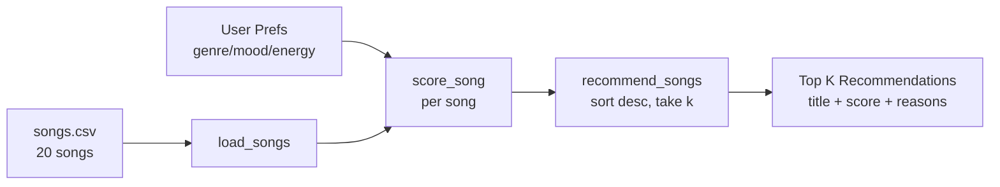

# 🎵 Music Recommender Simulation — VibeFinder 1.0

## Project Summary

VibeFinder 1.0 is a tiny content-based music recommender. It does not learn from other users;
it only compares each song's attributes (genre, mood, energy, valence, danceability, acousticness)
against a single user's taste profile. For every song, it produces a numeric score and a list of
human-readable reasons, then ranks the catalog and returns the top K matches.

The goal is not a production recommender — it is to see, in plain Python, how a few simple rules
turn structured data into ranked suggestions, and to notice where that simple logic over- or
under-represents certain tastes.

---

## How The System Works

### Real-world recommenders (at a glance)

Major platforms like Spotify and YouTube mix two families of algorithms:

- **Collaborative filtering** — "people like you also loved X." It looks at *behavior* across
  millions of users (plays, skips, saves, playlist adds, repeat listens) and finds patterns
  in *who co-listens to what*. It never needs to know anything about the song itself — only that
  users who overlap with you tended to enjoy it.
- **Content-based filtering** — "this song sounds like what you already love." It looks at
  *attributes of the item* (genre, tempo, key, mood, acoustic fingerprint, lyrics embeddings)
  and matches them to a profile of features you have historically liked.

In practice, production systems blend both: a hybrid model uses content features to solve the
"cold start" problem (new songs and new users with no behavior yet) and collaborative signals
to capture taste patterns that attributes alone can't express ("this producer's fans also love
that completely different genre").

**VibeFinder is content-based only.** It has no other users to learn from — just a catalog and
one person's stated preferences.

### What VibeFinder prioritizes

The system prioritizes **categorical matches first, numerical closeness second**:

- A matching `genre` is the strongest signal (songs in the wrong genre rarely feel right, no
  matter how close the energy is).
- A matching `mood` is the next strongest signal (mood is how a song *feels*, which often
  matters more than exact tempo).
- `energy` and `valence` are matched by *closeness* to the user's target, not by being
  higher/lower — someone asking for chill music doesn't want a slightly-less-intense rock song,
  they want something actually near their target level.
- Acoustic preference is a light bonus if the user opted in.

### Song features used

Each `Song` carries: `id`, `title`, `artist`, `genre`, `mood`, `energy` (0–1),
`tempo_bpm`, `valence` (0–1, musical positivity), `danceability` (0–1), `acousticness` (0–1).

### User profile fields

Each `UserProfile` carries: `favorite_genre`, `favorite_mood`, `target_energy` (0–1),
`likes_acoustic` (bool). The functional `user_prefs` dict used by `main.py` additionally
accepts optional `target_valence` so profiles can distinguish "high-energy + happy" from
"high-energy + angry."

### Algorithm Recipe (scoring rule for one song)

| Rule | Points |
|------|--------|
| Genre match (`song.genre == user.favorite_genre`) | +2.0 |
| Mood match (`song.mood == user.favorite_mood`) | +1.0 |
| Energy closeness | `+1.0 * (1 - |song.energy - target_energy|)` |
| Valence closeness (if `target_valence` set) | `+0.5 * (1 - |song.valence - target_valence|)` |
| Acoustic bonus (if `likes_acoustic` AND `song.acousticness >= 0.6`) | +0.5 |

**Why a closeness score instead of "bigger is better"?** Energy and valence are preferences, not
virtues. A user asking for `target_energy=0.3` does not want the most energetic song — they want
the closest match. `1 - |song - target|` rewards proximity in either direction and caps at 1.0.

**Why separate a Scoring Rule from a Ranking Rule?** The scoring rule is a *local judgment*:
given one song and one user, how well does it fit? The ranking rule is the *global step*: score
every song in the catalog, then sort descending and keep the top K. You need both because
"is this song good for this user?" and "which K songs are best?" are different questions —
the first is a per-item calculation, the second is a sort over the whole catalog.

### Data Flow



### Expected biases

- **Genre dominance.** Genre is worth 2.0 while energy closeness maxes out at 1.0, so a
  perfect-energy song in the wrong genre will lose to a mediocre-energy song in the right genre.
- **Catalog skew.** With only 20 songs, some genres (lofi, pop) have multiple entries while
  others (metal, folk, latin, hip hop) have one each — those single-entry genres always return
  the same song for users of that genre.
- **Mood-as-label.** "Happy" and "chill" are coarse strings. Two songs both labeled "happy" may
  feel very different; the system can't tell.

---

## Getting Started

### Setup

1. Create a virtual environment (optional but recommended):

   ```bash
   python -m venv .venv
   source .venv/bin/activate      # Mac or Linux
   .venv\Scripts\activate         # Windows
   ```

2. Install dependencies:

   ```bash
   pip install -r requirements.txt
   ```

3. Run the app:

   ```bash
   python -m src.main
   ```

### Running Tests

```bash
pytest
```

---

## Experiments You Tried

See the "Evaluation" section of [`model_card.md`](model_card.md) and per-profile comparisons
in [`reflection.md`](reflection.md).

Raw terminal captures (stand-in for screenshots, since this project is terminal-only) live in
[`docs/screenshots/all_profiles.txt`](docs/screenshots/all_profiles.txt) and
[`docs/screenshots/experiment.txt`](docs/screenshots/experiment.txt). Abridged below.

### Default profile — Pop / Happy / high-energy

```
python -m src.main
```

```
1. Sunrise City -- Neon Echo  (score 3.98)     pop / happy / 0.82
2. Gym Hero -- Max Pulse  (score 2.87)         pop / intense / 0.93
3. Rooftop Lights -- Indigo Parade (score 1.96) indie pop / happy / 0.76
4. Block Party Bounce -- Kid Riviera (score 1.96) hip hop / happy / 0.84
5. Festival Horizon -- Pulse Theory (score 1.85) edm / happy / 0.95
```

### High-Energy Pop

```
1. Sunrise City  (4.42)  pop happy 0.82
2. Gym Hero      (3.43)  pop intense 0.93
3. Festival Horizon (2.44) edm happy 0.95
4. Block Party Bounce (2.41) hip hop happy 0.84
5. Rooftop Lights (2.34) indie pop happy 0.76
```

### Chill Lofi Study

```
1. Library Rain    (4.97) lofi chill 0.35   <-- perfect match on every rule
2. Midnight Coding (4.92) lofi chill 0.42
3. Focus Flow      (3.93) lofi focused 0.40
4. Spacewalk Thoughts (2.88) ambient chill 0.28
5. Coffee Shop Stories (1.90) jazz relaxed 0.37
```

### Deep Intense Rock

```
1. Storm Runner   (4.48) rock intense 0.91  <-- ideal
2. Cold Static    (3.11) rock sad 0.62
3. Steel Mountain (2.36) metal intense 0.97
4. Gym Hero       (2.31) pop intense 0.93
5. Night Drive Loop (1.33) synthwave moody 0.75
```

### Adversarial: Sad but High-Energy (rock / sad / 0.9)

```
1. Cold Static   (4.20) rock sad 0.62   <-- mood + genre win, even though energy is off
2. Storm Runner  (3.35) rock intense 0.91
3. Steel Mountain (1.38) metal intense 0.97
4. Night Drive Loop (1.21) synthwave moody 0.75
5. Gym Hero      (1.19) pop intense 0.93
```

Shows the scoring choice in action: the user asked for energy 0.9 but got energy 0.62 at #1 —
because matching genre (+2.0) and mood (+1.0) together are worth more than perfect energy (+1.0).

### Adversarial: Acoustic EDM (edm / happy / 0.9 / likes_acoustic=True)

```
1. Festival Horizon  (4.44) edm happy 0.95   <-- the only edm in the catalog
2. Kitchen Sunlight  (2.59) jazz happy 0.55  <-- floats up because of the acoustic bonus
3. Sunrise City      (2.39) pop happy 0.82
4. Block Party Bounce (2.38) hip hop happy 0.84
5. Rooftop Lights    (2.31) indie pop happy 0.76
```

Illustrates a content-based blind spot: "acoustic EDM" is contradictory in this dataset,
so the runner-up is a mellow jazz song whose acousticness bonus pushed it over three
higher-energy happy tracks. A real recommender with collaborative signal would see that EDM
fans who like acoustic textures tend toward downtempo house or folktronica, and would recover
more gracefully.

### Weight-shift experiment (double energy, halve genre)

```
python -m src.experiment
```

With BASELINE (genre 2.0, energy 1.0):
```
1. Sunrise City (3.98)  pop happy 0.82
2. Gym Hero (2.87)      pop intense 0.93   <-- kept for genre
3. Rooftop Lights (1.96) indie pop happy 0.76
4. Block Party Bounce (1.96) hip hop happy 0.84
5. Festival Horizon (1.85) edm happy 0.95
```

With SHIFTED (genre 1.0, energy 2.0):
```
1. Sunrise City (3.96)  pop happy 0.82
2. Rooftop Lights (2.92) indie pop happy 0.76  <-- climbed past Gym Hero
3. Block Party Bounce (2.92) hip hop happy 0.84
4. Gym Hero (2.74)      pop intense 0.93       <-- dropped
5. Festival Horizon (2.70) edm happy 0.95
```

Halving the genre weight let mood-correct songs in adjacent genres (indie pop, hip hop)
overtake "Gym Hero", which is pop but the wrong mood. The top pick stayed stable because it
matches on every rule. This confirms that genre is acting as a dominant filter in the baseline.

---

## Limitations and Risks

Full discussion is in [`model_card.md`](model_card.md). Short version:

- 20-song catalog is far too small to generalize — results are essentially deterministic
  given a profile.
- Content-only: no collaborative signal, no feedback loop, no way to discover surprising matches.
- Genre/mood are single strings; a song can only belong to one.
- The weights were chosen by hand, not learned from any data.

---

## Reflection

See the final section of [`model_card.md`](model_card.md) and [`reflection.md`](reflection.md).
